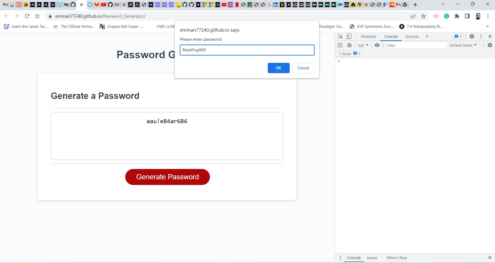

# Console_Finances

#
The code in this repository generates a random password from the users input. The users input is validated based on the stipulated constraints. A live demo can be found [here](https://emman77240.github.io/Password_Generator/).

## Description
In this repository, a random password is programmatically computed from a user's input using JavaScript. A live demonstration can be seen by clicking the generate password button on the page. 

This website is hosted on GitHub Pages, enabling it to be seen world wide when the website address is visited.

## Installation
N/A

## Usage
Click the red generate password button which is visible on the page. Follow the prompts to provide input which would allow your random password to be generated.

## License
MIT License